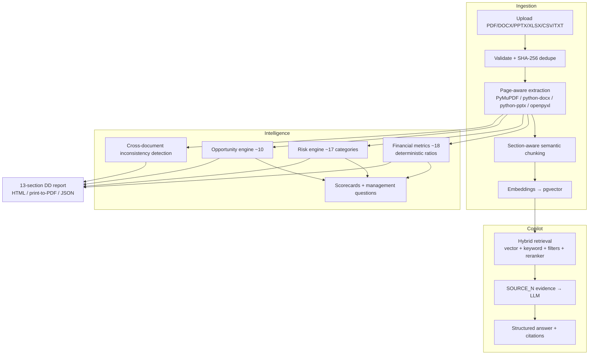

# AI Due Diligence Copilot

An evidence-backed **AI due-diligence platform** for analysts: upload company filings and investor materials, get a page-cited financial/risk/opportunity analysis, a retrieval-augmented copilot, and an exportable due-diligence report — every number and every claim traceable to a document and page.

> This is **not** chat-with-PDF. It is a pipeline: documents → document intelligence → evidence layer → financial intelligence → risk & opportunity engines → RAG copilot → DD report.

## Feature map



### What makes it trustworthy
- **Backend-mapped citations** — the LLM may only cite `SOURCE_N` ids; the backend resolves them to document + page. The frontend never trusts model-provided page numbers.
- **Deterministic financial math** — all ratios/trends computed by unit-tested pure Python; the LLM never does arithmetic.
- **Typed claims** — answers separate `fact | analysis | recommendation | uncertainty | contradiction`, with an explicit insufficient-evidence state.
- **Explainable risks** — every finding carries signals, thresholds, evidence quotes, "What we found / Why it matters / Potential impact / What to investigate".
- **Safe by default** — tenant isolation, sanitized uploads, size limits, prompt-injection defense line, offline mode with zero external calls.

## Tech stack
- **Frontend**: Next.js 14 (App Router) · React 18 · TypeScript · Tailwind CSS · Recharts · Lucide
- **Backend**: FastAPI · Pydantic v2 · SQLAlchemy 2 · Alembic
- **Database**: PostgreSQL + pgvector (SQLite fallback for pure-local dev)
- **Documents**: PyMuPDF, python-docx, python-pptx, openpyxl, pandas/numpy
- **AI**: OpenAI chat + embeddings via env config — with a deterministic offline fallback so everything runs without an API key
- **Tests**: pytest (46 tests incl. RAG eval harness) · TypeScript build-time checks

## Quick start (Docker)

```bash
cp .env.example .env          # set SECRET_KEY; add OPENAI_API_KEY optionally
docker compose up --build
# frontend  → http://localhost:3000
# API docs  → http://localhost:8000/docs
# login     → demo@example.com / demo1234
```

The backend container runs migrations and seeds a synthetic demo company (**Aurora Industrial Group** — growth, rising debt, margin decline, customer concentration, an expansion opportunity, and a deliberate two-document contradiction) automatically.

## Local development (no Docker)

```bash
# Backend
cd backend
python -m venv .venv && source .venv/bin/activate
pip install -r requirements.txt
cp ../.env.example .env                 # SQLite fallback works out of the box
alembic upgrade head
python -m app.seed                      # demo user + synthetic company
uvicorn app.main:app --reload --port 8000

# Frontend (second terminal)
cd frontend
npm install
cp .env.example .env.local              # NEXT_PUBLIC_API_URL=http://localhost:8000
npm run dev                             # http://localhost:3000
```

## Tests

```bash
cd backend && python -m pytest -q       # units (ratios, risk rules, chunking, extraction) + API flow + RAG eval
cd frontend && npx tsc --noEmit
```

The RAG evaluation harness (`tests/test_rag_evaluation.py`, benchmark corpus in `app/sample_data/generator.py`) scores retrieval & citation correctness against known page locations in the synthetic documents.

## Layout

```
backend/app/{api,models,schemas,services/*,prompts,core}
frontend/app/{login,dashboard,companies/[id]/*,reports/[reportId]}
frontend/components   reusable UI (MetricCard, RiskCard, CitationBadge, DocumentViewer, …)
docs/                 architecture, rag, financial-analysis, risk-engine, api, security, development
docker/               backend & frontend Dockerfiles
scripts/              seed + smoke-test helpers
```

## Configuration
See `.env.example` — database, secret key, OpenAI models/dimension, upload limits, chunking tokens, retrieval top-k, reranker, CORS. Everything degrades gracefully offline.

## Disclaimer
Analytical assistance only — not financial, legal, tax, or investment advice. Every screen and report states this.
