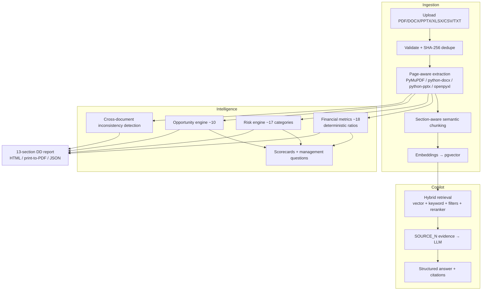

# AI Due Diligence Copilot

An evidence-backed **AI due-diligence platform** for analysts: upload company filings and investor materials, get a page-cited financial/risk/opportunity analysis, a retrieval-augmented copilot, and an exportable due-diligence report — every number and every claim traceable to a document and page.

> This is **not** chat-with-PDF. It is a pipeline: documents → document intelligence → evidence layer → financial intelligence → risk & opportunity engines → RAG copilot → DD report.

## Why this project

The core design goal is **verifiable analysis** rather than plausible-sounding AI output. Deterministic financial calculations, backend-owned citations, typed claims, explicit uncertainty, tenant isolation, upload validation, and prompt-injection defenses are part of the application architecture rather than afterthoughts.

## Feature map



### What makes it trustworthy
- **Backend-mapped citations** — the LLM may only cite `SOURCE_N` ids; the backend resolves them to document + page. The frontend never trusts model-provided page numbers.
- **Deterministic financial math** — ratios and trends are computed by unit-tested pure Python; the LLM never performs the arithmetic.
- **Typed claims** — answers separate `fact | analysis | recommendation | uncertainty | contradiction`, with an explicit insufficient-evidence state.
- **Explainable risks** — every finding carries signals, thresholds, evidence quotes, "What we found / Why it matters / Potential impact / What to investigate".
- **Safe by default** — tenant isolation, sanitized uploads, size limits, prompt-injection defenses, and an offline mode with zero external AI calls.
- **Deployment-aware storage** — local filesystem storage works for development; production can use Cloudflare R2 through its S3-compatible API.

## Tech stack

- **Frontend**: Next.js 14 (App Router) · React 18 · TypeScript · Tailwind CSS · Recharts · Lucide
- **Backend**: FastAPI · Pydantic v2 · SQLAlchemy 2 · Alembic
- **Database**: PostgreSQL + pgvector (SQLite fallback for pure-local dev)
- **Documents**: PyMuPDF, python-docx, python-pptx, openpyxl, pandas/numpy
- **Storage**: local filesystem for development · Cloudflare R2 / S3-compatible object storage for persistent deployments
- **AI**: OpenAI chat + embeddings via environment configuration, with deterministic offline fallback
- **Tests**: pytest · RAG retrieval/citation evaluation harness · TypeScript build-time checks

## Quick start (Docker)

```bash
cp .env.example .env
docker compose up --build
```

Open:

- Frontend → http://localhost:3000
- API docs → http://localhost:8000/docs
- Health → http://localhost:8000/api/health
- Demo login → `demo@example.com` / `demo1234`

The checked-in `.env.example` is intentionally configured for a **local/demo deployment**: it supplies working Docker database credentials, creates the demo user, and enables the synthetic demo-data seed. Change these values and disable demo seeding for staging/production.

The Docker backend runs Alembic migrations automatically before starting the API. The demo seed creates **Aurora Industrial Group** with synthetic filings covering growth, rising debt, margin decline, customer concentration, an expansion opportunity, and a deliberate two-document contradiction.

## Production configuration

For a real deployment, keep secrets out of Git and configure them in the hosting provider's environment-variable settings.

Required backend settings:

```text
ENVIRONMENT=production
SECRET_KEY=<strong-random-secret>
DATABASE_URL=<PostgreSQL connection string>
CORS_ORIGINS=<comma-separated frontend origin(s)>

STORAGE_BACKEND=r2
R2_ENDPOINT_URL=https://<ACCOUNT_ID>.r2.cloudflarestorage.com
R2_BUCKET=<bucket-name>
R2_ACCESS_KEY_ID=<access-key>
R2_SECRET_ACCESS_KEY=<secret-key>

# Optional live AI
OPENAI_API_KEY=<key>
AI_PROVIDER=auto
EMBEDDING_PROVIDER=auto
```

`STORAGE_BACKEND=local` remains appropriate for local development. When `STORAGE_BACKEND=r2` is selected, the application stores original documents in R2 while keeping document metadata, extracted pages, chunks, embeddings, and analysis results in PostgreSQL.

The application health endpoint checks database connectivity and returns HTTP 503 when the database is unavailable, allowing a platform health check to detect a broken backend.

## Local development (without Docker)

```bash
# Backend
cd backend
python -m venv .venv
# macOS/Linux: source .venv/bin/activate
# Windows PowerShell: .venv\Scripts\Activate.ps1
pip install -r requirements.txt
cp ../.env.example .env
alembic upgrade head
python -m app.seed
uvicorn app.main:app --reload --port 8000

# Frontend (second terminal)
cd frontend
npm install
cp .env.example .env.local
npm run dev
```

For a completely isolated local backend, use the SQLite fallback in `backend/app/core/config.py` or set a SQLite `DATABASE_URL` explicitly.

## Tests

```bash
cd backend && python -m pytest -q
cd frontend && npx tsc --noEmit
```

The RAG evaluation harness (`tests/test_rag_evaluation.py`, benchmark corpus in `app/sample_data/generator.py`) checks retrieval and citation correctness against known page locations in the synthetic documents.

## Layout

```text
backend/app/{api,models,schemas,services/*,prompts,core}
frontend/app/{login,dashboard,companies/[id]/*,reports/[reportId]}
frontend/components   reusable UI (MetricCard, RiskCard, CitationBadge, DocumentViewer, …)
docs/                 architecture, RAG, financial analysis, risk engine, API, security, development
docker/               backend & frontend Dockerfiles
scripts/              seed + smoke-test helpers
```

## Security notes

The application treats uploaded documents as untrusted input. Uploads are validated and size-limited, extracted content is not treated as instructions, model output is constrained by application-side evidence rules, and all document access is scoped to the authenticated company/tenant context.

This repository does **not** commit real credentials or production secrets. Use `.env.example` as a configuration reference only.

## Disclaimer

Analytical assistance only — not financial, legal, tax, or investment advice. Every screen and report states this.
