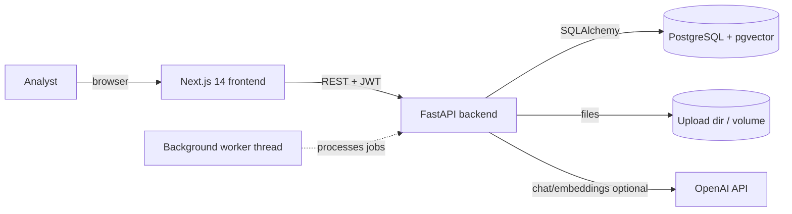
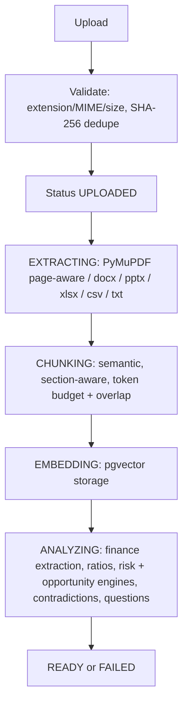
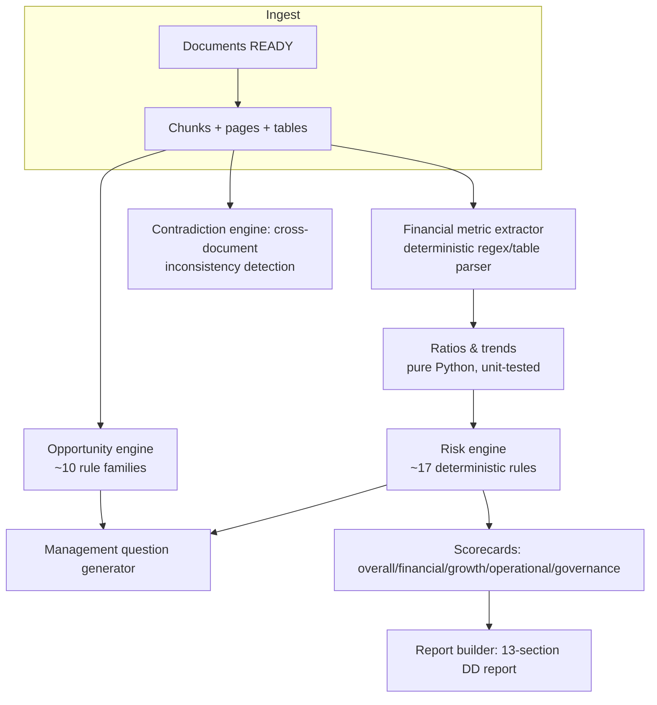

# Architecture

AI Due Diligence Copilot is a **modular monolith**: one FastAPI backend, one Next.js frontend, one PostgreSQL (+pgvector) database. No Kafka, no microservices, no external search engine — every capability is a plain Python/TypeScript module that could later be extracted if needed.

## System context

## Pipeline (per document)

Statuses are persisted on the `documents` row and exposed via `GET /api/companies/{id}/documents` and `GET /api/jobs/{job_id}`.

## Analysis flow

## Key backend modules

| Module | Responsibility |
|---|---|
| `app/services/ingestion` | file validation, dedupe, processing pipeline, background jobs |
| `app/services/extraction` | page-aware text extraction per format; table normalization (`{value, currency, unit, period, source_page}`) |
| `app/services/chunking` | section-aware semantic chunking (token budget, overlap, metadata) |
| `app/services/embeddings` | OpenAI or offline hashing embedder; pgvector storage; dimension configurable |
| `app/services/retrieval` | hybrid retrieval (vector + keyword + metadata filters + source priority), reranker abstraction |
| `app/services/rag` | prompt assembly, SOURCE_N evidence protocol, citation mapping, structured answers |
| `app/services/finance` | metric extraction + deterministic ratio/trend/compare math |
| `app/services/risk` | rule-based risk detection with evidence and follow-ups |
| `app/services/opportunity` | rule-based opportunity detection |
| `app/services/contradiction` | cross-document consistency checks |
| `app/services/questions` | evidence-grounded management questions |
| `app/services/reports` | executive summary + 13-section report (JSON/HTML/print-to-PDF) |
| `app/services/analysis` | job orchestration (worker thread pool, Celery-swappable) |

## Frontend structure

- `app/` — App Router pages: `/`, `/dashboard`, `/companies`, `/companies/[id]/{documents,financials,risks,opportunities,chat,reports,search}`, `/reports/[reportId]`, login/register.
- `components/` — small reusable pieces (`MetricCard`, `RiskCard`, `CitationBadge`, `DocumentViewer`, `FinancialChart`, `ChatMessage`, `SourcePanel`, states…).
- `lib/api.ts` — typed fetch wrapper, auth token handling, upload helper; `hooks/` — data fetching, polling, auth, toasts.

## Data ownership

Every table that stores company data carries `company_id`, and **every query is tenant-scoped** through dependencies that verify ownership against the JWT user. Documents are stored outside the web root with sanitized filenames; downloads stream through an authenticated endpoint.
